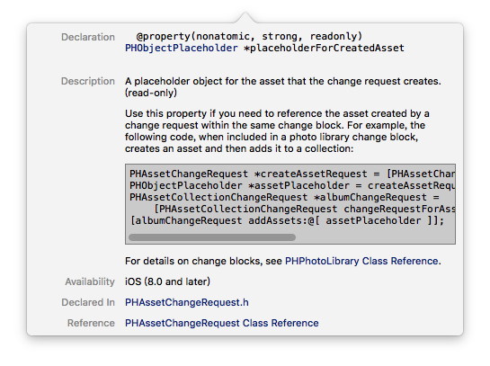

获取相簿列表

```swift
    [PHAssetCollection fetchAssetCollectionsWithType:PHAssetCollectionTypeAlbum
                                             subtype:PHAssetCollectionSubtypeAny options:nil];
```

读取相簿名

```swift
	collection.localizedTitle
```

创建相簿

```swift
        [[PHPhotoLibrary sharedPhotoLibrary] performChanges:^{
            [PHAssetCollectionChangeRequest creationRequestForAssetCollectionWithTitle:@"我的相簿"];
        } completionHandler:^(BOOL success, NSError *error) {

        }];
```

保存视频到相簿

添加视频到相册

```swift
    [[PHPhotoLibrary sharedPhotoLibrary] performChanges:^{
        PHAssetChangeRequest *assetChangeRequest = [PHAssetChangeRequest creationRequestForAssetFromVideoAtFileURL:fileUrl];
        PHAssetCollectionChangeRequest *assetCollectionChangeRequest = [PHAssetCollectionChangeRequest changeRequestForAssetCollection:albumAssetCollection];
        [assetCollectionChangeRequest addAssets:@[[assetChangeRequest placeholderForCreatedAsset]]];
        }
    } completionHandler:^(BOOL success, NSError *error) {
    }];
```

