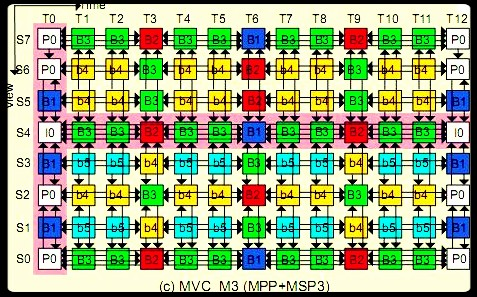
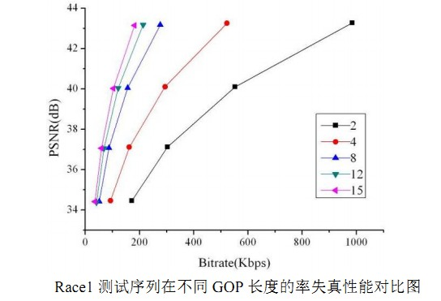

视频压缩中，每帧代表一幅静止的图像。而在实际压缩时，会采取各种算法减少数据的容量，其中IPB就是最常见的。
  
简单地说，I帧是关键帧，属于帧内压缩。就是和AVI的压缩是一样的。 P是向前搜索的意思。B是双向搜索。他们都是基于I帧来压缩数据。
  

I帧表示关键帧，你可以理解为这一帧画面的完整保留；解码时只需要本帧数据就可以完成（因为包含完整画面）

P帧表示的是这一帧跟之前的一个关键帧（或P帧）的差别，解码时需要用之前缓存的画面叠加上本帧定义的差别，生成最终画面。（也就是差别帧，P帧没有完整画面数据，只有与前一帧的画面差别的数据）

B帧是双向差别帧，也就是B帧记录的是本帧与前后帧的差别（具体比较复杂，有4种情况），换言之，要解码B帧，不仅要取得之前的缓存画面，还要解码之后的画面，通过前后画面的与本帧数据的叠加取得最终的画面。B帧压缩率高，但是解码时CPU会比较累~。

从上面的解释看，我们知道I和P的解码算法比较简单，资源占用也比较少，I只要自己完成就行了，P呢，也只需要解码器把前一个画面缓存一下，遇到P时就使用之前缓存的画面就好了，如果视频流只有I和P，解码器可以不管后面的数据，边读边解码，线性前进，大家很舒服。
但网络上的电影很多都采用了B帧，因为B帧记录的是前后帧的差别，比P帧能节约更多的空间，但这样一来，文件小了，解码器就麻烦了，因为在解码时，不仅要用之前缓存的画面，还要知道下一个I或者P的画面（也就是说要预读预解码），而且，B帧不能简单地丢掉，因为B帧其实也包含了画面信息，如果简单丢掉，并用之前的画面简单重复，就会造成画面卡（其实就是丢帧了），并且由于网络上的电影为了节约空间，往往使用相当多的B帧，B帧用的多，对不支持B帧的播放器就造成更大的困扰，画面也就越卡。
 
一般平均来说，I的压缩率是7（跟JPG差不多），P是20，B可以达到50，可见使用B帧能节省大量空间，节省出来的空间可以用来保存多一些I帧，这样在相同码率下，可以提供更好的画质。

下面举例说明：  

  

在如上图中，GOP (Group of Pictures)长度为13，S0~S7 表示 8个视点，T0~T12 为 GOP的 13个时刻。每个 GOP包含帧数为视点数 GOP 长度的乘积。在该图中一个 GOP 中，包含94 个 B帧。B 帧占一个 GOP 总帧数的 90.38%。GOP 越长，B 帧所占比例更高，编码的率失真性能越高。下图测试序列 Race1 在不同 GOP 下的率失真性能对比。

[原文地址](http://blog.csdn.net/abcjennifer/article/details/6577934)