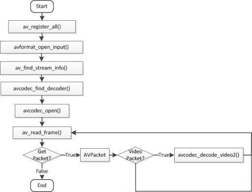

##  基于FFmpeg的视频解码
---

```swift
    av_register_all();   //FFMpeg初始化
    avformat_network_init();
    AVFormatContext *pContext = avformat_alloc_context(); //格式IO上下文
    avformat_open_input(&pContext, input_str_full, NULL, NULL); //打开文件流
    int nb_streams = pContext->nb_streams;  //流数量
    int videoStreamIndex = -1;
    /**
     *  查找视频流
     */
    for (int i = 0; i<nb_streams; i++) {
        if (pContext->streams[i]->codec->codec_type == AVMEDIA_TYPE_VIDEO) {
            videoStreamIndex = i;
            break;
        }
    }
    
    
    AVPacket *pkt = av_malloc(sizeof(AVPacket));
    
    
    AVFrame *fr = av_frame_alloc();

    
    int nb_frames = 0;
    int got ;
    
    AVCodecContext *cContext = pContext->streams[videoStreamIndex]->codec;//IO上下文->视频流 -> 解码上下文
    
    while (av_read_frame(pContext, pkt) == 0) {
        if (pkt->stream_index == videoStreamIndex) {
            
            if (ret < 0) {
                break;
            }
            avcodec_decode_video2(cContext, fr, &got, pkt);
            if (got > 0) {
                nb_frames++;
            }

        }
    }
    
    
    avformat_close_input(&pContext);
    av_free_packet(pkt);
    av_frame_free(&fr);
```

